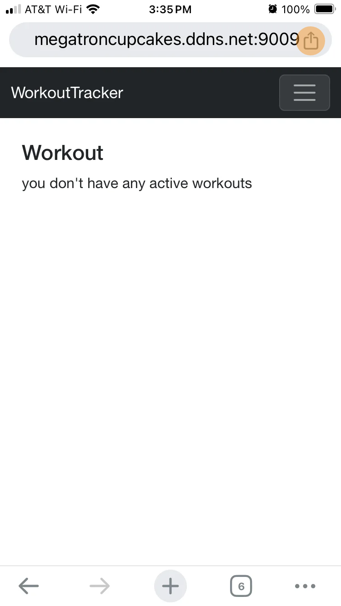
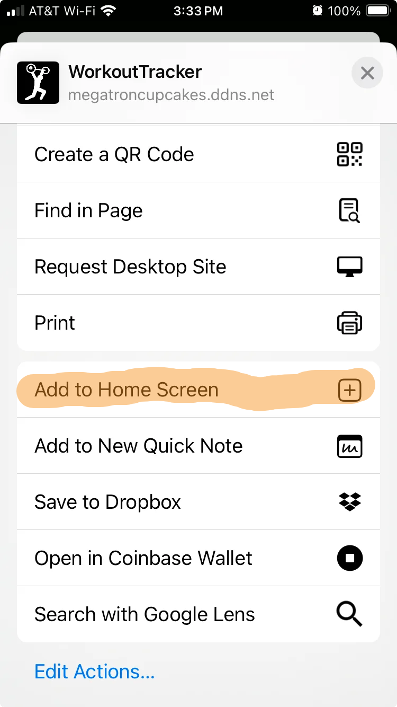
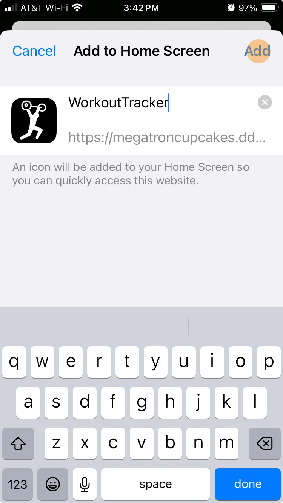
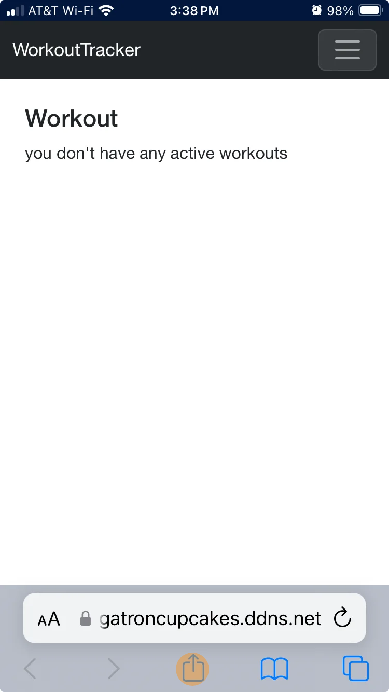
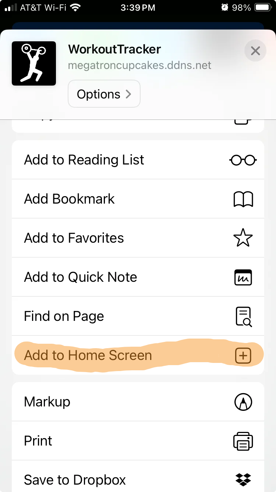
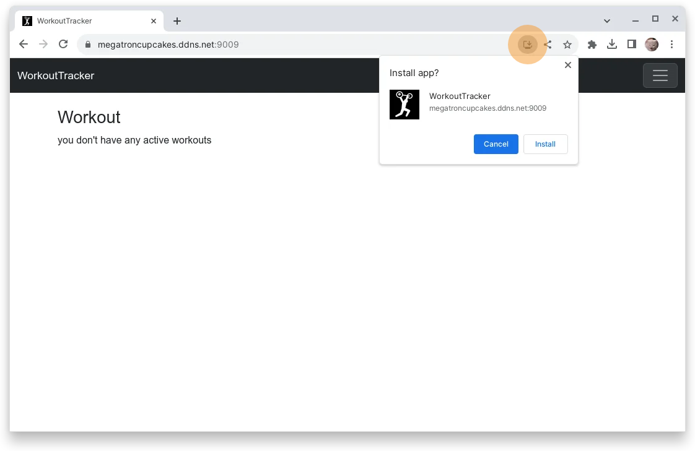
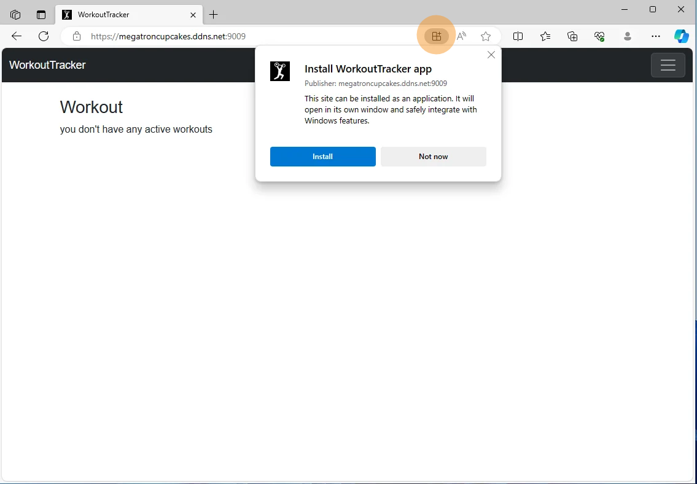

# WorkoutTracker
Aging is rough. As I get older and as more aspects of life compete for my time and attention, it's harder and harder to maintain my fitness. While I’m no professional athlete and certainly not a bodybuilder, I do regularly lift weights to maintain muscle mass and bone density. I currently track my workouts using a spreadsheet. While this enables me to measure progress, it is not exactly convenient.  Enter the WorkoutTracker.

WorkoutTracker is a Progressive Web Application (PWA) built with C# (with Blazor Webassembly) and JavaScript.  A PWA allows for the convenience of a mobile or desktop application (I plan to use WorkoutTracker on my iPhone) without the hassle of lengthy and tedious App Store approvals.  WorkoutTracker is designed to be completely self-contained and offline-capable; it uses IndexedDb for data persistence, leveraging a custom JavaScript interface mimicing MongoDb's query and update interfaces.
### Code:You Capstone Project Features
1. Generic Class for IndexedDb integration; stores and retrieves data for multiple Types
2. Asynchronicity
3. Multiple inter-related entitites


### Running WorkoutTracker
just visit [WorkoutTracker on the web](https://megatroncupcakes.ddns.net:9009/), there's no need to clone, download, or configure anything!


#### (Optionally) Installing the PWA on mobile or desktop is simple:

##### chrome mobile
<p>
  
  
  
</p>

##### safari mobile
<p>
  
  
  
</p>

##### firefox mobile
Firefox for iOS does not support installing PWA's.  Firefox for Android reportedly supports installing PWA's but has not been tested with WorkoutTracker.

##### chrome desktop
<p></p>

##### edge desktop
<p></p>

##### firefox desktop
mozilla removed PWA (or more accurately SSB - Single Site Browser) support from Firefox


#### Running from source:
Or if you'd prefer, you can clone the repo and run it yourself with VisualStudio or VSCode.
```
git clone https://github.com/MegatronCupcakes/WorkoutTracker.git
```


#### Run with Docker:
OR if your're feeling adventurous and want to host your own instance, you can build your own Docker image:
```
git clone https://github.com/MegatronCupcakes/WorkoutTracker.git
cd ./WorkoutTracker/WorkoutTracker
docker build -t megatroncupcakes/workout-tracker:latest .
```
then start up a container:
```
docker run -p 8080:80 megatroncupcakes/workout-tracker:latest
```
WorkoutTracker will be available at localhost:8080
